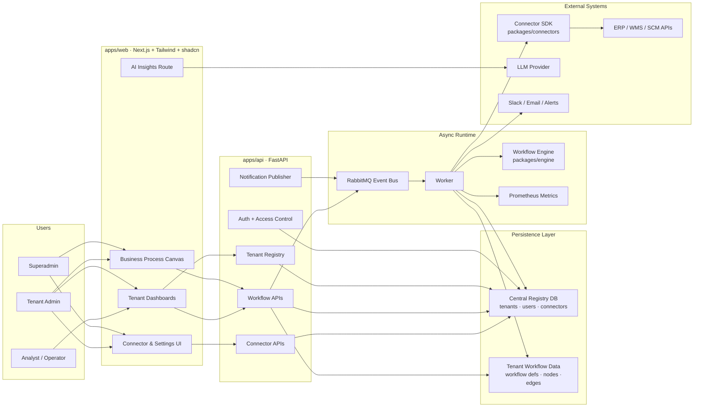
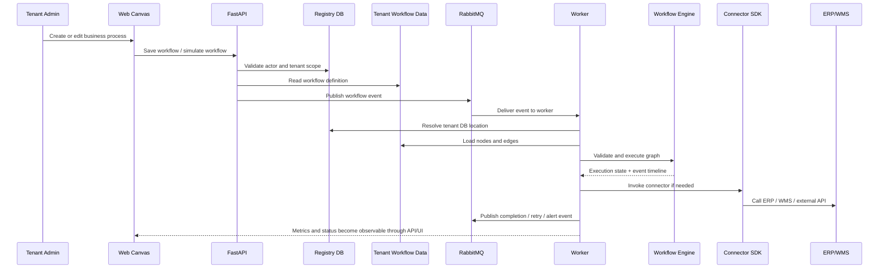
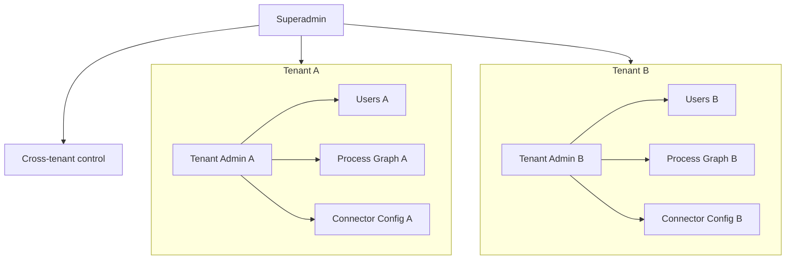

# EasyFlow Architecture

EasyFlow is a multi-tenant process operating system for supply chain teams. Each tenant defines its own business process graph, the UI operates on that graph, the API governs tenant and workflow access, and the runtime executes workflow events asynchronously through RabbitMQ.

## Product Architecture

## Request To Execution Flow

## Tenant Isolation Model

## What Each Layer Owns

- `apps/web`
  Customer-facing product shell, tenant dashboards, business process canvas, forecasting views, connector setup, and AI analysis UI.

- `apps/api`
  Tenant creation, RBAC enforcement, workflow access, connector registration, alert publishing, and runtime-facing service endpoints.

- `packages/engine`
  Graph validation, workflow simulation, node/edge execution modeling, and execution timeline generation.

- `apps/api/app/worker.py`
  RabbitMQ consumer, retry and DLQ behavior, workflow execution handoff, and Prometheus metrics.

- `packages/connectors`
  Pluggable integration layer for SAP, Oracle, Relex, and generic HTTP-based systems.

## Current Product Shape

Today, EasyFlow is best understood as:

1. A tenant-aware process design surface.
2. A workflow API and access-control layer.
3. An event-driven execution runtime.
4. A connector-ready orchestration layer.
5. An emerging AI insight layer on top of operational graph data.

## Next Architecture Upgrades

- Persist process graphs and execution history fully in Neon/Postgres.
- Add live event streaming from RabbitMQ into the UI.
- Move AI insights behind a dedicated orchestration service instead of a direct web route.
- Add connector credential vaulting and per-tenant secret isolation.
- Add real workflow execution state machines instead of simulation-first execution.
