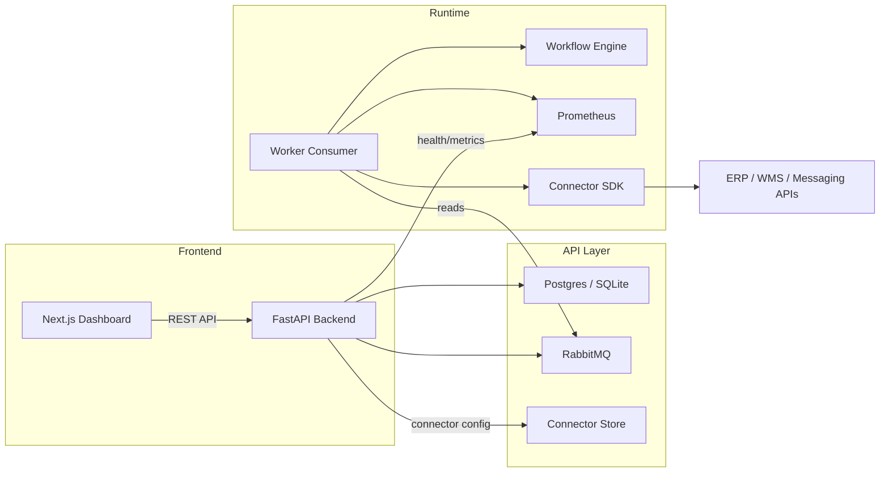

# EasyFlow Architecture

EasyFlow is built as a modular workflow platform with three main layers:

1. **Frontend** - Tenant experience and admin settings.
2. **API** - Tenant registration, workflow management, event publishing, and connector configuration.
3. **Worker / Runtime** - RabbitMQ consumer, workflow execution engine, retry/DLQ handling, and metrics.

## Component Overview

- `apps/web` - Next.js user interface for dashboards, tenant onboarding, and integrations.
- `apps/api` - FastAPI backend that exposes REST endpoints and publishes workflow events.
- `packages/engine` - Reusable Python workflow engine for graph validation and runtime execution.
- `packages/connectors` - Pluggable connector SDK for ERP/WMS/HTTP integrations.
- `tests` - Test coverage for engine behavior and access control.
- `examples` - Sample workflow definitions to bootstrap tenant configurations.

## Data Flow

1. The user interacts with the Next.js frontend.
2. The frontend calls the FastAPI backend for tenant and workflow operations.
3. The backend persists registry and connector metadata, then publishes workflow events to RabbitMQ.
4. The worker consumes RabbitMQ events and uses the workflow engine to resolve execution state.
5. The worker emits Prometheus metrics and may publish notification events.
6. Connectors can be invoked from the worker or API to sync data with external ERP/WMS systems.

## Architecture Diagram

## Integration Points

- **RabbitMQ** provides asynchronous workflow event processing.
- **Prometheus** exposes worker metrics for queue health and retry behavior.
- **AIO-Pika** powers robust message consumption with DLQ semantics.
- **SQLAlchemy / Alembic** support the registry schema and tenant data model.

## Strategy for Open Source Growth

- Keep the core engine small and reusable.
- Build connectors as isolated pluggable packages.
- Separate frontend dashboard concerns from backend execution concerns.
- Document architecture clearly so new contributors can own a single layer.

## Next Architecture Enhancements

- Add a separate tenant migration service for per-tenant database schemas.
- Add a connector marketplace layer and config vault.
- Add a real-time workflow dashboard with execution event streams.
- Add a dedicated notifications service for Slack/Email/SMS.
