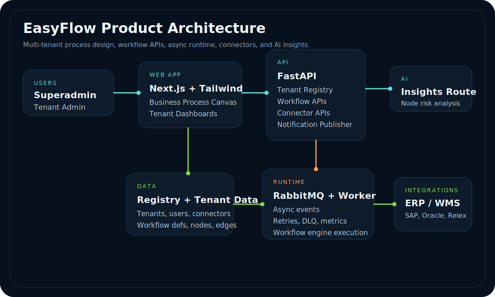
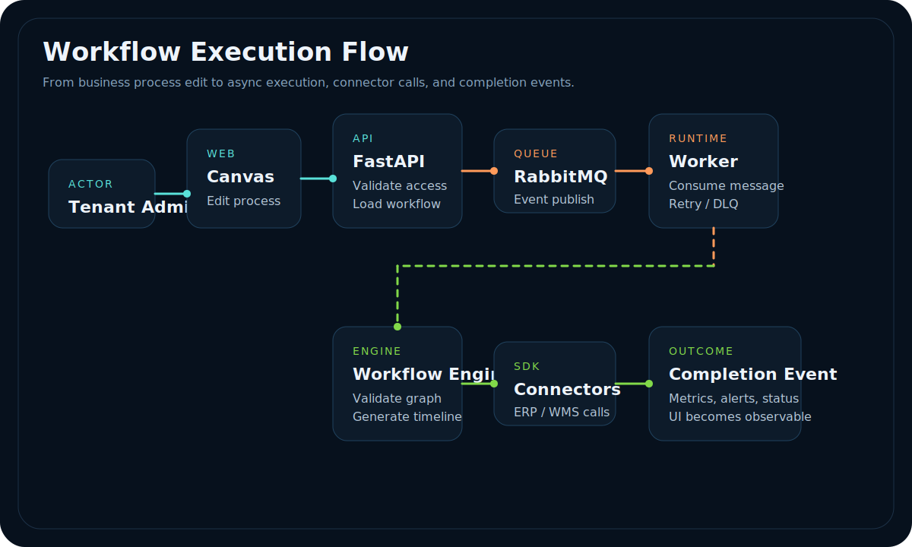
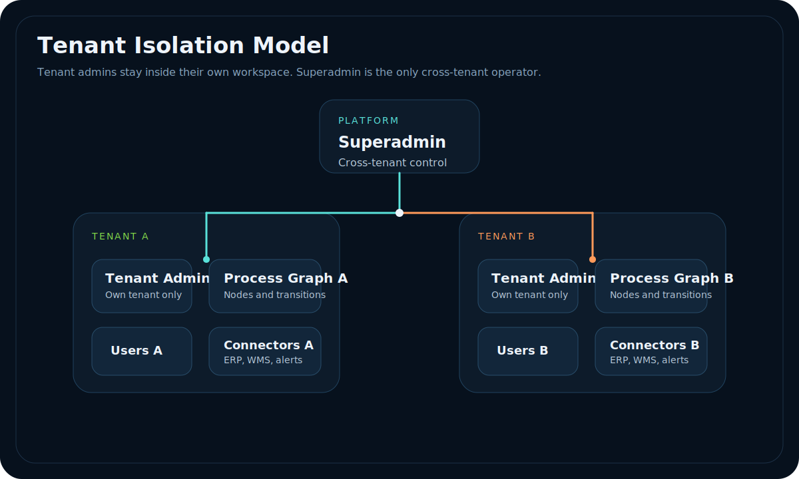

# EasyFlow

**EasyFlow** is a modern, open-source workflow orchestration platform for multi-tenant supply chain operations. It enables each company to run its own configurable workflow graph, isolate its data per tenant, and extend the runtime with event-driven execution, notifications, and integrations.

---

## Overview

EasyFlow is built to be the standard open source product for operational workflow automation in supply chain and logistics. It is not an ERP system — it is the workflow layer that sits above ERPs, WMS, procurement engines, and supplier networks.

Key capabilities today:

- Tenant-isolated workflow runtime
- Workflow graph modeling and execution simulation
- RabbitMQ-based event handling and worker processing
- Notification publishing and connector-ready integration scaffolding
- Next.js admin dashboard for tenant and integration settings

---

## Vision

EasyFlow will become the open source orchestration fabric for supply chain teams who need:

- A shared workspace for independent tenants and companies
- A flexible workflow graph that models approvals, stocking, shipments, and exceptions
- A worker-driven runtime with retries, dead-letter handling, and observability
- A connector ecosystem for ERP, WMS, CRM, and messaging systems
- AI-powered operational insights and proactive alerts

This repo is the foundation for that vision.

---

## Tech Stack

| Layer | Technology |
|---|---|
| Frontend | Next.js 14, React, Tailwind CSS |
| API | FastAPI, Pydantic, SQLAlchemy, Alembic |
| Worker | Python async worker, `aio-pika`, Prometheus metrics |
| Database | PostgreSQL / SQLite tenant DBs |
| Messaging | RabbitMQ |
| Workflow Engine | `packages/engine` Python package |
| Connectors | `packages/connectors` pluggable adapter SDK |

---

## Project Structure

```text
/apps
  api/          FastAPI backend, migrations, worker, and service API
  web/          Next.js admin dashboard and tenant UX
/packages
  engine/       reusable Python workflow engine core
  connectors/   connector factory, HTTP adapter, and plugin support
/examples
  procurement_workflow.json  sample workflow definition
/tests
  test_access_control.py
  test_workflow_engine.py
```

---

## Architecture

EasyFlow is organized around five product concerns:

1. **Business Process Design** — each tenant defines its own process graph in the web canvas.
2. **Tenant-Aware API Layer** — FastAPI enforces superadmin versus tenant-admin access boundaries.
3. **Workflow Persistence** — tenant, user, connector, node, and edge data live in the platform data model.
4. **Async Execution Runtime** — RabbitMQ and the worker execute workflow events outside the request path.
5. **Connector + AI Extensions** — ERP/WMS integrations and AI analysis sit on top of the workflow graph.

### Product Architecture



This diagram shows the full product shape.

- **Users** enter through the web application as `superadmin`, `tenant admin`, or analyst/operator roles.
- **`apps/web`** contains the business process canvas, tenant dashboards, settings, and AI insight surfaces.
- **`apps/api`** acts as the control plane for tenant management, workflow APIs, notifications, and connector CRUD.
- **Persistence** is split conceptually between the central registry data and tenant workflow data.
- **RabbitMQ + the worker** form the async runtime so workflow execution and side effects do not block UI requests.
- **External systems** are reached through the pluggable connector SDK, while AI insight calls sit beside the operational flow.

### Request To Execution Flow



This diagram explains how a single workflow action moves through the system.

1. A tenant admin edits or simulates a business process from the canvas.
2. The web app sends that request to FastAPI.
3. FastAPI validates the actor, resolves tenant scope, and loads the workflow definition.
4. The API publishes an event into RabbitMQ instead of doing heavy execution inline.
5. The worker consumes the event, loads tenant workflow data, and invokes the workflow engine.
6. The workflow engine validates the graph and produces execution state and timeline output.
7. If the workflow needs external synchronization, the worker calls ERP/WMS systems through the connector SDK.
8. The worker emits completion, retry, alert, and metrics signals back into the platform.

This is the core architectural distinction of EasyFlow: the UI is for modeling and control, while the runtime handles execution asynchronously.

### Tenant Isolation Model



This diagram explains the security and control boundary.

- A **tenant admin** can manage only the users, process graph, and connectors inside that tenant.
- A **superadmin** is the only role allowed to operate across all tenants.
- Each tenant owns its own process graph and integration surface.
- This keeps EasyFlow multi-tenant without turning it into a single shared workflow namespace.

That access model already exists in the backend scaffold:

- `superadmin` has cross-tenant workflow control.
- `tenant_admin` is tenant-scoped.
- `analyst` is limited to tenant-local views.

Read the fuller engineering breakdown in [ARCHITECTURE.md](./ARCHITECTURE.md).

---

## Quick Start

```bash
cd /Users/vamsikrishna/Documents/EasyFlow
python -m venv .venv
source .venv/bin/activate
pip install -r apps/api/requirements.txt
cd apps/web
npm install
```

Run RabbitMQ locally:

```bash
docker compose up -d rabbitmq
```

Start the API:

```bash
cd /Users/vamsikrishna/Documents/EasyFlow
PYTHONPATH=. uvicorn apps.api.app.main:app --reload
```

Start the worker process:

```bash
source .venv/bin/activate
PYTHONPATH=. python -m apps.api.app.worker
```

Start the web frontend:

```bash
cd apps/web
npm run dev
```

Visit the app at `http://localhost:3000`.

---

## Development Commands

| Command | Description |
|---|---|
| `python -m unittest discover -s tests` | Run Python workflow engine tests |
| `cd apps/web && npm run dev` | Start the frontend developer server |
| `PYTHONPATH=. uvicorn apps.api.app.main:app --reload` | Start the FastAPI backend |
| `PYTHONPATH=. python -m apps.api.app.worker` | Start the RabbitMQ worker |

---

## CI / CD

This repository already includes GitHub Actions workflows:

- `.github/workflows/ci.yml` — runs Python tests and builds the web app on every push/PR
- `.github/workflows/cd-docker.yml` — builds and pushes Docker images for `main`

The package is configured to push Docker images to GitHub Container Registry.

---

## What’s Next (Roadmap)

These are the next PRs that will make EasyFlow product-ready:

1. **Auth & Tenant Onboarding** — add email/password login, tenant signup flow, and RBAC.
2. **Connector Marketplace** — standardized connector registry, UI market, and secure credential vault.
3. **Workflow Persistence & Audit Logs** — store executions, logs, and state history in Postgres.
4. **Alerts & Notifications** — add Slack/email/SMS channels and workflow-driven alerts.
5. **AI Orchestration** — add predictive bottleneck detection, risk scoring, and workflow recommendations.
6. **Open Source Contribution Kit** — docs, templates, good-first-issue labels, and community governance.

---

## Contributor Guide

We want EasyFlow to grow as a community product:

- Open issues for bugs, feature ideas, and docs improvements.
- Submit PRs against `main` with clear descriptions and tests.
- Keep each PR focused on one feature or bug fix.
- Add examples and docs for every new connector and workflow capability.

See [CONTRIBUTING.md](./CONTRIBUTING.md).

---

## Vision for EasyFlow

EasyFlow will become the workflow fabric for supply chain operators, connecting ERP systems, warehouses, suppliers, and analytics in a shared tenant-aware platform.

It will let teams:

- model workflows once and run them across tenants
- connect to any ERP or WMS through a pluggable connector layer
- monitor execution health with worker metrics and alerting
- extend workflows with AI and proactive automation

The goal is to make EasyFlow the open source control plane for supply chain orchestration.

---

## License

This project is released under the MIT License. See [LICENSE](./LICENSE).
