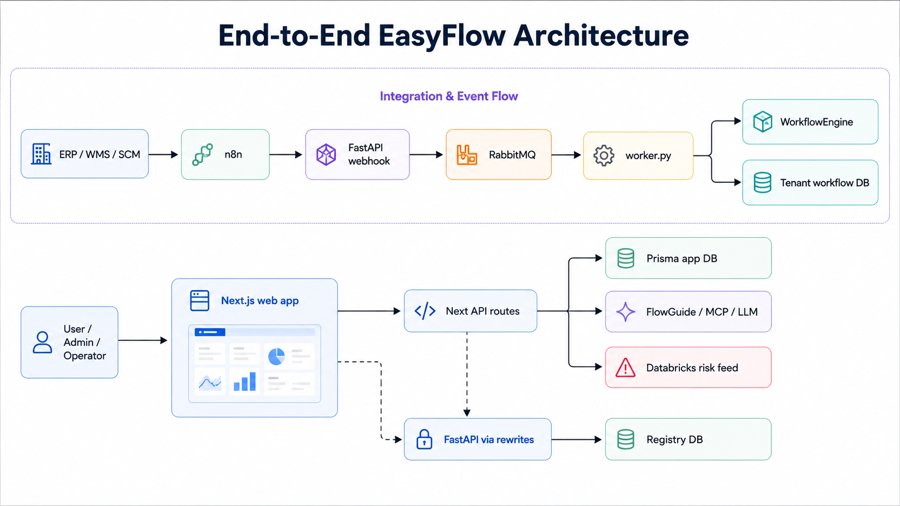

# EasyFlow

EasyFlow is an open-source, multi-tenant operational coordination layer for supply chain teams.

It sits above ERP, warehouse, logistics, supplier, and planning systems and turns raw operational data into:

- visual process flows
- tenant-isolated workspaces
- dashboards and risk views
- automation and event handling
- AI-assisted explanations through FlowGuide

EasyFlow is not trying to replace SAP, Oracle, Dynamics, NetSuite, Infor, or warehouse software. The goal is to make the operational work around those systems easier to see, understand, and act on.

## What EasyFlow does

EasyFlow helps teams answer questions like:

- What is delayed right now?
- Which approvals are still pending?
- Which warehouse or supplier needs attention first?
- Where is inventory coverage getting tight?
- What should happen next in the workflow?

Instead of pushing users through large ERP screens, spreadsheet follow-up, and inbox coordination, EasyFlow gives them a visual operating surface for daily work.

## Current product capabilities

The current codebase includes:

- Multi-tenant workspaces with isolated tenant routes under `apps/web/app/globe/tenant/[tenant]`
- A visual process canvas for business workflows
- Tenant modules for inventory, logistics, suppliers, users, automation, and logistics management
- A tenant overview page with operational KPIs, active process context, and risk intelligence
- FlowGuide, an AI assistant for tenant-scoped operational questions
- Webhook- and n8n-friendly integration architecture
- FastAPI backend services, RabbitMQ event flow, PostgreSQL/Prisma data models, and self-hosted deployment paths
- Public product pages for landing, connectors, docs, pitch, and architecture

## Product story

Most supply chain teams already have data. What they usually do not have is a good way to work through it.

The data lives across:

- ERP systems
- warehouse tools
- planning software
- supplier updates
- shipment portals
- spreadsheets
- email threads and follow-up calls

EasyFlow turns that fragmented operating reality into a single working surface. Warehouses, suppliers, products, approvals, orders, and shipments become connected business entities instead of scattered records.

That is the real value of the product:

- less status chasing
- clearer ownership
- earlier risk visibility
- better decisions from the same operational data

## Main user-facing areas

### Public product surface

- `/landing`
  - product entry page with animated supply chain visual
- `/pitch`
  - product pitch for the EasyFlow operating model
- `/connectors`
  - public connectors catalog
- `/docs`
  - product, architecture, and integration documentation
- `/architecture`
  - interactive architecture diagrams

### App surface

- `/globe`
  - tenant workspace entry
- `/globe/tenant/[tenant]`
  - tenant overview
- `/workflows`
  - business process canvas
- `/dashboard`
  - operational dashboard
- `/forecasting`
  - forecasting and forward-looking views
- `/settings`
  - integration and platform settings

### Tenant modules

Each tenant workspace currently exposes:

- Overview
- Inventory
- Logistics
- Suppliers
- Users
- Automation & Integration
- Logistic Management

## FlowGuide AI assistant

FlowGuide is the tenant-scoped assistant layer inside EasyFlow.

Today it is designed to answer operational questions such as:

- Which SKUs are at risk?
- What orders are likely to slip?
- Which approvals are still pending?
- Which supplier is creating downstream pressure?
- What needs attention first?

Current implementation highlights:

- LangChain orchestration
- MCP-backed tenant tools
- Ollama/local model path
- provider abstraction for additional LLM backends
- tenant-scoped knowledge documents and risk signals

FlowGuide is built to reason over EasyFlow’s own operating context rather than generic prompting alone.

## Risk intelligence

The current web app also includes a local risk-intelligence layer that derives operational signals from tenant data, including:

- inventory pressure
- order slip risk
- supplier delay risk
- shipment exception risk

Those signals are surfaced in:

- tenant overview pages
- FlowGuide context
- tenant APIs under `/api/tenant/[slug]/risk-signals`

## Tech stack

### Frontend

- Next.js 14
- React 18
- TypeScript
- Tailwind CSS
- Framer Motion
- Recharts
- React Flow / XYFlow

### Backend and runtime

- FastAPI
- Python
- RabbitMQ
- PostgreSQL
- Prisma
- Zod

### AI and agent layer

- LangChain
- MCP
- Ollama
- provider abstraction for additional LLM backends

### Local/self-hosted workflow

- Docker Compose
- n8n
- Neon-compatible database path for lighter deployments

## Repo structure

```text
EasyFlow/
├── apps/
│   ├── api/                  # FastAPI backend
│   └── web/                  # Next.js product UI
├── packages/
│   ├── connectors/           # Connector abstractions and webhook adapters
│   └── engine/               # Workflow engine
├── public/                   # README assets and exported diagrams
├── docker-compose.yml
├── ARCHITECTURE.md
├── DEPLOY_ORACLE_FREE.md
└── ORACLE_BEGINNER_STEPS.md
```

## Deployment paths

EasyFlow currently supports two practical deployment modes:

- Full self-hosted stack:
  - see [DEPLOY_ORACLE_FREE.md](DEPLOY_ORACLE_FREE.md)
- Frontend/demo-oriented path with hosted database:
  - see `apps/web` deployment notes and Vercel/Neon setup already used in the app

## Architecture diagrams

The repo now includes multiple architecture and flow diagrams in `public/` and in `apps/web/public/diagrams/`.

### 1. System Architecture


What it shows:

- the major layers of EasyFlow
- how the web app, API, workflow engine, connectors, queue, and storage fit together
- where external systems plug into the platform

Why it matters:

- this is the best top-level diagram for explaining EasyFlow to recruiters, engineers, or product stakeholders

### 2. End-to-End Architecture



What it shows:

- the full product path from external system signals to UI, workflows, and insight generation
- how operational data moves through the platform from ingestion to user-facing output

Why it matters:

- this is the strongest diagram for telling the “operating layer above raw enterprise data” story

### 3. Request Execution Flow


What it shows:

- how one business request or event flows through EasyFlow
- intake, processing, execution, and completion logic
- where workflow steps, services, and state transitions happen

Why it matters:

- this is the clearest diagram for showing how EasyFlow turns an event into action

### 4. Tenant Isolation Architecture


What it shows:

- how tenant isolation is modeled
- how workspaces, data boundaries, and per-tenant execution stay separated

Why it matters:

- this is the best diagram for explaining the multi-tenant design of the platform

### 5. MCP AI Agent Architecture


What it shows:

- how FlowGuide uses the MCP/tool layer
- how tenant-scoped operational context is exposed to the AI layer
- how the assistant reasons over data instead of relying only on free-form prompting

Why it matters:

- this is the most important diagram for explaining the agentic AI side of EasyFlow

### 6. SVG diagram set used by the app

The app also includes SVG versions under `apps/web/public/diagrams/`:

- `apps/web/public/diagrams/platform-architecture.svg`
- `apps/web/public/diagrams/execution-flow.svg`
- `apps/web/public/diagrams/tenant-isolation.svg`

These power the interactive architecture viewer in the app and provide lighter-weight visual assets for docs and UI.

## What the diagrams collectively explain

Taken together, the diagram set explains:

1. how the whole system is organized
2. how one request flows through it
3. how multi-tenancy is enforced
4. how the AI assistant is grounded in tenant-specific tools and data

That means the repo now includes both:

- product-facing visuals
- engineering-facing architecture visuals

## Current business use cases

EasyFlow is currently strongest as a foundation for:

- inventory and replenishment coordination
- approval tracking and handoff visibility
- shipment and logistics follow-up
- supplier risk and downstream impact visibility
- tenant-scoped operational Q&A with AI

## What is implemented vs. what is still a framework

Implemented today:

- multi-tenant app shell and tenant routes
- business process canvas
- tenant overview and modules
- FlowGuide assistant
- risk signal generation
- webhook/API architecture
- RabbitMQ-based event path
- architecture/pitch/connectors public product surface

Framework/integration-ready but not fully production-validated against specific enterprise tenants:

- direct live ERP integrations across every vendor
- large-scale production telemetry and observability
- enterprise-grade customer deployment validation

The right framing is:

EasyFlow already implements the operating layer, workflow surface, AI layer, and architecture. Specific system integrations can be validated and extended in real customer environments without changing the core product idea.

## Local development

### Web app

```bash
cd apps/web
npm install
npm run dev
```

If the Next.js UI goes stale during development:

```bash
cd apps/web
npm run dev:clean
```

### API

```bash
cd apps/api
uv sync
uv run uvicorn app.main:app --reload
```

## Related docs

- [ARCHITECTURE.md](ARCHITECTURE.md)
- [DEPLOY_ORACLE_FREE.md](DEPLOY_ORACLE_FREE.md)
- [ORACLE_BEGINNER_STEPS.md](ORACLE_BEGINNER_STEPS.md)

## Summary

EasyFlow is a visual operational layer on top of raw enterprise supply chain data.

It combines:

- tenant-isolated workspaces
- workflow execution and coordination
- operational visibility
- risk intelligence
- AI-assisted explanation

The codebase already reflects that direction, and the diagrams in this repo make the architecture and product story easier to understand for both technical and non-technical readers.
